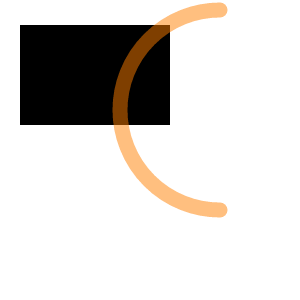

### canvas

&lt;canva&gt;新增的元素，可以用来javascript绘制图形，多用于游戏方面，下面就用来绘制简单图形吧.

```
<canvas id="canvas" width="300" height="300"></canvas>
<script>
var canvas = document.getElementById("canvas");
// 从canvas获取二维环境
var ctx = canvas.getContext("2d");
// 绘制填充矩形起点坐标x:20,y:25；width:150,height:100
ctx.fillRect(20, 25, 150, 100);
// 创建一个新的路径
ctx.beginPath();
// 绘制圆弧路径圆心坐标x:220,y:110;半径:100;圆弧的起始点(Math.PI * 1/2)弧度;圆弧的终点(Math.PI * 3/2)弧度
ctx.arc(220, 110, 100, Math.PI * 1/2, Math.PI * 3/2);
// 路径宽度
ctx.lineWidth = 15;
// 线段末端属性为以圆形结束
ctx.lineCap = 'round';
// 画笔颜色为rgba(255, 127, 0, 0.5)色
ctx.strokeStyle = 'rgba(255, 127, 0, 0.5)';
// 绘制当前或已经存在的路径的方法
ctx.stroke();
</script>
```

**效果图**



**随着鼠标移动而变色的canvas例子**

```
<!doctype html>
<html>
<head>
<meta charset="utf-8">
<title>canvas 2</title>
<style>
body {
  background: #fff;
}
canvas {
  position: absolute;
  top: 0;
  left: 0;
  /*等比例拉伸画布*/
  height: 100%;
  width: 100%;
}
</style>
</head>

<body>
<canvas height="600" width="600"></canvas>
<script>
window.onload = function () {
  var canvas = document.querySelectorAll('canvas')[0],
      ctx = canvas.getContext('2d');
    
  document.body.onmousemove = function (event) {
    var width = window.innerWidth, 
        height = window.innerHeight, 
        x = event.clientX, 
        y = event.clientY,
        rx = 600 * x / width,
        ry = 600 * y / height;
        
    var xc = ~~(256 * x / width);
    var yc = ~~(256 * y / height);
    // 开始圆形圆心坐标:rx, ry和半径0; 结束圆形圆心坐标:也是rx, ry和半径600
    var grad = ctx.createRadialGradient(rx, ry, 0, rx, ry, 600);
    // 添加一个由偏移值和颜色值指定的断点到渐变，会PS应该可以很好理解
    // 偏移:0也就是开始; 16进制表示的纯黑色
    grad.addColorStop(0, '#000');
    // 偏移:1也就是结束; RGB色:红色从左0到右255变化,绿色255和红色的差,蓝色从上0到下255变化
    grad.addColorStop(1, ['rgb(', xc, ', ', (255 - xc), ', ', yc, ')'].join(''));
    // 应用这个渐变色
    ctx.fillStyle = grad;
    // 填充矩形区域
    ctx.fillRect(0,0,600,600);
  };
};
</script>
</body>
</html>
```

MDN好教程[Canvas教程](https://developer.mozilla.org/zh-CN/docs/Web/API/Canvas_API/Tutorial)


